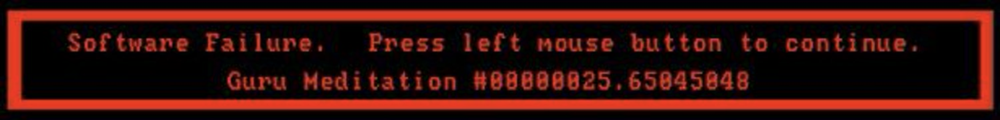

# `-include("me.hrl")`

&nbsp;&nbsp;&nbsp;

&nbsp;&nbsp;&nbsp;

## Self

> **nostalgeek • monadist • egoless open source buidler**

Veteran in code & chaos, crafting AI-driven, blockchain-powered, and cloud-native systems.

I operate at the event horizon of **innovation and pragmatism**, where strategy meets execution. Whether leading teams or deep-diving into code, I build **architecturally sound systems** that don’t just work — they **matter**.

## `[▮▮▮▮▮▯▯▯▯▯▯▯] 42% in progress`

• CTO @[Axone](https://axone.xyz) [:octocat:](https://github.com/axone-protocol/) - the universal orchestration protocol to connect, share, and monetize any resources in the AI stack ([Cosmos SDK](https://cosmos.network/), [CosmWasm](https://cosmwasm.com/), [Rust](https://www.rust-lang.org/), [Go](https://go.dev/)). 
• Co-founder @[2Alchemist](https://krossboard.app/) [:octocat:](https://github.com/2-alchemists/) - Optimizing cloud-native infrastructures with smart resource management ([kubernetes](https://kubernetes.io/), [typescript](https://www.typescriptlang.org/)).

## Prime directives

• Open-source or it didn’t happen – Code is a common good, open and accessible. 
• [Egoless](https://blog.codinghorror.com/the-ten-commandments-of-egoless-programming/) Coding – Embrace collaboration, accept critique, and focus on the work. 
• Precision Craftsmanship – Build solutions that endure beyond hype and trends. 
• Mentorship Loop – Grow the team, grow the tech. Autonomy + shared learning = scale. 
• Small is Beautiful & Less is More - because simplicity scales, complexity breaks.

## Pigment palette

Love _designing_. Love _architecting_. Love _languages_, _syntax_, _patterns_, and _paradigms_.

• The Ancient — [Forth](<https://en.wikipedia.org/wiki/Forth_(programming_language)>), [Pascal](<https://en.wikipedia.org/wiki/Pascal_(programming_language)>), [Prolog](https://en.wikipedia.org/wiki/Prolog). 
• The Singular — [Erlang](https://www.erlang.org/), [Elm](https://elm-lang.org/), [Haskell](https://www.haskell.org/). 
• The Practical — [Go](https://go.dev), [Rust](https://www.rust-lang.org), [Scala](https://www.scala-lang.org/), [Kotlin](https://kotlinlang.org). 

## The human in the Geek

• Father of a future hacker - raising a curious mind one byte at a time. 
• Two feline overlords graciously allow me to live in their home. 
• Started my coding quest at age 10 on a [Hector 2HR](<https://en.wikipedia.org/wiki/Hector_(microcomputer)>) before leveling up to the [Amiga 500](https://en.wikipedia.org/wiki/Amiga_500). 
• Rooted in the 80s - where vintage tech, CRT glow, and well-crafted objects had a soul.

 

## 🔧 Languages and Tools

  
  
  
  
  
  
  
  
  
  
  
  
  
  
  
  
  
  
  
  
  
  
  
  
  
  
  
  
  
  
  
  
  
  
  
  
  
  

 

💻 A glimpse into my digital habitat lives [here](https://github.com/ccamel/chez-ccamel).

## 🔭 Latest releases I've contributed to

<ul>

  <li><code><a href="https://github.com/rchakode/kube-opex-analytics">rchakode/kube-opex-analytics</a></code>&nbsp;<a href="https://github.com/rchakode/kube-opex-analytics/releases/tag/v25.10.0"></img></a>&nbsp;•&nbsp;🎨 Kubernetes Usage Analytics Engine &amp; Dashboards for Cost Allocation and Capacity Planning - Hourly Trends, Daily and Monthly Accounting. Actively tested against AKS, EKS, GCP, OKE, and OpenShift. </li>
  <li><code><a href="https://github.com/ccamel/erlang-event-sourcing-xp">ccamel/erlang-event-sourcing-xp</a></code>&nbsp;<a href="https://github.com/ccamel/erlang-event-sourcing-xp/releases/tag/v1.1.0"></img></a>&nbsp;•&nbsp;🧪 Experimenting with Event Sourcing in Erlang</li>
  <li><code><a href="https://github.com/axone-protocol/contracts">axone-protocol/contracts</a></code>&nbsp;<a href="https://github.com/axone-protocol/contracts/releases/tag/v8.0.0"></img></a>&nbsp;•&nbsp;📜 Smart contracts for the Axone protocol (powered by CosmWasm)</li>
  <li><code><a href="https://github.com/axone-protocol/axoned">axone-protocol/axoned</a></code>&nbsp;<a href="https://github.com/axone-protocol/axoned/releases/tag/v13.0.0"></img></a>&nbsp;•&nbsp;⛓️ Axone blockchain 💫</li>
  <li><code><a href="https://github.com/mikeleppane/visualvault">mikeleppane/visualvault</a></code>&nbsp;<a href="https://github.com/mikeleppane/visualvault/releases/tag/v0.8.0"></img></a>&nbsp;•&nbsp;Terminal-based media file organizer with smart date-based organization, duplicate detection, and a beautiful TUI. Organize your photo/video collection efficiently from the command line. Written in Rust using Ratatui </li>
  <li><code><a href="https://github.com/strangelove-ventures/heighliner">strangelove-ventures/heighliner</a></code>&nbsp;<a href="https://github.com/strangelove-ventures/heighliner/releases/tag/v1.7.4"></img></a>&nbsp;•&nbsp;Repository of docker images for the node software of Cosmos chains</li>
  <li><code><a href="https://github.com/axone-protocol/axone-sdk">axone-protocol/axone-sdk</a></code>&nbsp;<a href="https://github.com/axone-protocol/axone-sdk/releases/tag/v1.2.0"></img></a>&nbsp;•&nbsp;💻 The Axone SDK for the Go programming language to build applications on top of the Axone protocol</li>
  <li><code><a href="https://github.com/axone-protocol/axone-mcp">axone-protocol/axone-mcp</a></code>&nbsp;<a href="https://github.com/axone-protocol/axone-mcp/releases/tag/v1.0.0"></img></a>&nbsp;•&nbsp;🤖 Axone’s MCP server – gateway to the dataverse for AI-powered tools</li>
  <li><code><a href="https://github.com/axone-protocol/cosmos-extractor">axone-protocol/cosmos-extractor</a></code>&nbsp;<a href="https://github.com/axone-protocol/cosmos-extractor/releases/tag/v1.0.0"></img></a>&nbsp;•&nbsp;🌌 CLI tool for extracting diverse data from Cosmos chain snapshots</li>
  <li><code><a href="https://github.com/ccamel/playground-elm">ccamel/playground-elm</a></code>&nbsp;<a href="https://github.com/ccamel/playground-elm/releases/tag/v3.8.0"></img></a>&nbsp;•&nbsp; :balloon: My playground for playing with elm-lang</li>
</ul>

## ✍️ My Latest Blog Posts

- [Axone’s architecture, for the curious buildlr](https://blog.axone.xyz/axones-architecture-for-the-curious-buildlr-2367c41c8dff?source=rss-79c7e8ef7569------2)
- [The Power of Machines, the Duty of Humans](https://blog.axone.xyz/the-power-of-machines-the-duty-of-humans-8d9e664ce3d1?source=rss-79c7e8ef7569------2)
- [Why Is there a walrus in my code?](https://medium.com/@camel.christophe/why-is-there-a-walrus-in-my-code-fc3cf4bcb88a?source=rss-79c7e8ef7569------2)
- [Beyond Traditional Governance: Embracing On-Chain with OKP4 (3/3)](https://blog.axone.xyz/beyond-traditional-governance-embracing-on-chain-with-okp4-3-3-424f7a8eb2fc?source=rss-79c7e8ef7569------2)
- [Beyond Traditional Governance: Embracing On-Chain with OKP4 (2/3)](https://blog.axone.xyz/beyond-traditional-governance-embracing-on-chain-with-okp4-2-3-17237d68033c?source=rss-79c7e8ef7569------2)

## ⭐ Recent Stars

- [`biomejs/biome`](https://github.com/biomejs/biome) (1 day ago) • A toolchain for web projects, aimed to provide functionalities to maintain them. Biome offers formatter and linter, usable via CLI and LSP.
- [`geofmureithi/apalis`](https://github.com/geofmureithi/apalis) (1 day ago) • Type-safe, extensible, and high-performance background processing library for Rust
- [`burnt-labs/xion`](https://github.com/burnt-labs/xion) (1 day ago)
- [`sakofchit/system.css`](https://github.com/sakofchit/system.css) (2 days ago) • A design system for building retro Apple interfaces
- [`JayanAXHF/filessh`](https://github.com/JayanAXHF/filessh) (3 days ago) • A fast and convenient TUI file browser for remote servers
- [`bgreenwell/xleak`](https://github.com/bgreenwell/xleak) (3 days ago) • A fast terminal Excel viewer with an interactive TUI. Features full-text search, formula display, lazy loading for large files, clipboard support, and export to CSV/JSON. Built with Rust and ratatui.
- [`arangodb/arangodb`](https://github.com/arangodb/arangodb) (4 days ago) • 🥑 ArangoDB is a native multi-model database with flexible data models for documents, graphs, and key-values. Build high performance applications using a convenient SQL-like query language or JavaScript extensions.
- [`charmbracelet/vhs`](https://github.com/charmbracelet/vhs) (5 days ago) • Your CLI home video recorder 📼
- [`htin1/toktop`](https://github.com/htin1/toktop) (5 days ago) • llm usage monitor in terminal
- [`pipeseroni/pipes.sh`](https://github.com/pipeseroni/pipes.sh) (1 week ago) • Animated pipes terminal screensaver

## 👯 My recent Followers

- [`@REIJISAKAMAKI`](https://github.com/REIJISAKAMAKI)
- [`@gurveeer`](https://github.com/gurveeer)
- [`@0xnightfly`](https://github.com/0xnightfly)
- [`@mychael-boykins`](https://github.com/mychael-boykins)
- [`@d3rLord3`](https://github.com/d3rLord3)
- [`@carlosTopdev`](https://github.com/carlosTopdev)
- [`@ivasik-k7`](https://github.com/ivasik-k7)
- [`@rohitdhiman123`](https://github.com/rohitdhiman123)
- [`@mateosoul`](https://github.com/mateosoul)
- [`@refaktor`](https://github.com/refaktor)

## 📕 My Latest Gists

- [My personal archive of surrealist prompts](https://gist.github.com/4bed0857811867dcdb5491bfdc975578) (4 days ago)
- [my own collection of absurd and self-referential paradoxes from within the machine](https://gist.github.com/d4c7a7cd812906dfebc61a027805029d) (1 week ago)
- [One-liner sorcery to rip stats from the Axone Cognitarium smart contract (🔗 https://axone.xyz)](https://gist.github.com/75628fd9b042f30cfaaf2507338f9b50) (8 months ago)
- [One-liner to conjure all Axone airdrop giga-chads — proof of participation on-chain (https://airdrop.axone.xyz)](https://gist.github.com/25a453db78023df8c8cd7bf9c20be800) (8 months ago)
- [Bash sorcery to summon all WASM contracts from the Axone chain and unveil their real nature](https://gist.github.com/f8aea954bc73d5cad3f33812085b3b88) (9 months ago)
- [A collection of handy one-liners leveraging the Axoned CLI for interacting with the Axone blockchain](https://gist.github.com/44cbc7d8e42f183dcbc78c85ebf404d0) (10 months ago)
- [Simple magical one-line bash command to graph KatAI contributions over time (https://katai.xyz)](https://gist.github.com/f27603e36d7b4e6f2bfc5c5454f71cdd) (1 year ago)

## 📈 GitHub Stats

## 🏆 Trophies

<h4><a href="https://github.com/ccamel">Trophies</a></h4>

<!-- my-badges start -->
<h4><a href="https://github.com/my-badges/my-badges">My Badges</a></h4>

<!-- my-badges end -->

 

---

Generated using <a href="https://profilinator.rishav.dev/" target="_blank">Github Profilinator</a> / <a href="https://rahuldkjain.github.io/gh-profile-readme-generator/" target="_blank">gh-profile-readme-generator</a> + some customizations

